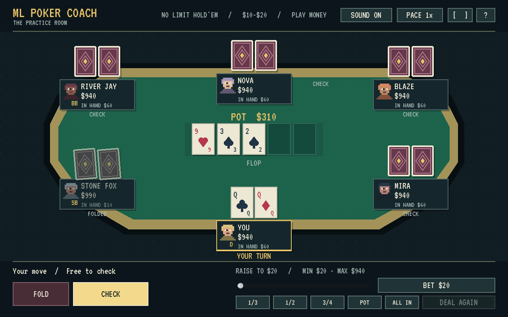

# ML Poker Coach

A retro Texas Hold'em practice game. Play against five bot opponents, watch the
hand unfold, then review your decisions in a beginner-friendly coach's notebook.



The new game client uses **Godot 4.5.2 / GDScript**. **Python / FastAPI** owns the
rules, hidden cards, legal actions, bot decisions and hand evaluation. The original
React / TypeScript client remains in `frontend/`.

## What works today

- A playable six-seat Godot table with original pixel portraits, card art and sound.
- Animated dealing, persistent flop/turn/river reveals, chips and showdown.
- Legal Fold, Check/Call, Bet/Raise and All In controls, with sizing presets.
- Bots finish after you fold; the result stays until you choose Deal Again.
- Post-hand feedback based on decisions, simulated equity and pot odds.
- Local browser and macOS exports, slower pacing, fullscreen and poker basics.

**ML status:** the coach and bots currently use rules and Monte Carlo estimation,
not trained ML policies. Training data, a learned model and held-out evaluation
are the next research milestone.

**First playable slice:** Deal Again starts a fresh $1,000 practice hand. Stacks
and history do not yet carry across hands. Reviews are isolated per hand; saved
profiles and longer sessions are planned. Games live in API memory, and both
clients require the backend. This is not yet a hosted release.

## Run the game

Install Godot **4.5.2** and Python **3.11+**. In one terminal:

```bash
cd backend
python3 -m pip install -e '.[dev]'
python3 -m uvicorn app.main:app --reload --port 8000
```

Open `game/project.godot` in Godot and press F5, or run from the repo root:

```bash
godot --path game
```

The desktop API defaults to `http://127.0.0.1:8000`; set `POKER_API_URL` before
launching to override it. The web client uses `/api` on its own origin.

### Browser build

Install matching templates using Godot's **Manage Export Templates**. From the
repo root:

```sh
mkdir -p game/build/web
godot --headless --path game --editor --import --quit
godot --headless --path game --export-release Web
python3 tools/serve_game.py --port 5174
```

Open [the Godot game](http://localhost:5174/). Port 5173 still serves the legacy
React client. The preview server proxies the API on port 8000. Gameplay scales
into a fixed 1280x800 scene with letterboxing and no page scrolling. Desktop and
landscape are recommended; portrait is playable but small.

### Native build

```sh
godot --headless --path game --export-release macOS
```

The ZIP appears in `game/build/`. This is an unsigned local prototype requiring
the backend, not yet a notarized standalone distribution.

## Verification

```sh
cd backend
python3 -m pytest -q
```

With the API running, from the repo root:

```sh
godot --headless --path game -- --smoke
godot --headless --path game -- --smoke-fold
```

The first smoke test exercises all betting streets, persistent card identities,
chip conservation and review loading. The second folds the hero and verifies
that bots finish. Both use the real Godot client and API.

## Architecture and roadmap

See [the game architecture](docs/GODOT_GAME.md) for state ownership, animation
sequencing, limitations and the path to a trained coaching model.

VT323 by Peter Hull is bundled under the SIL Open Font License in
`game/assets/fonts/OFL.txt`. Card-back artwork, portraits and sounds are original
project assets. Godot is MIT licensed; install its runtime and templates separately.
